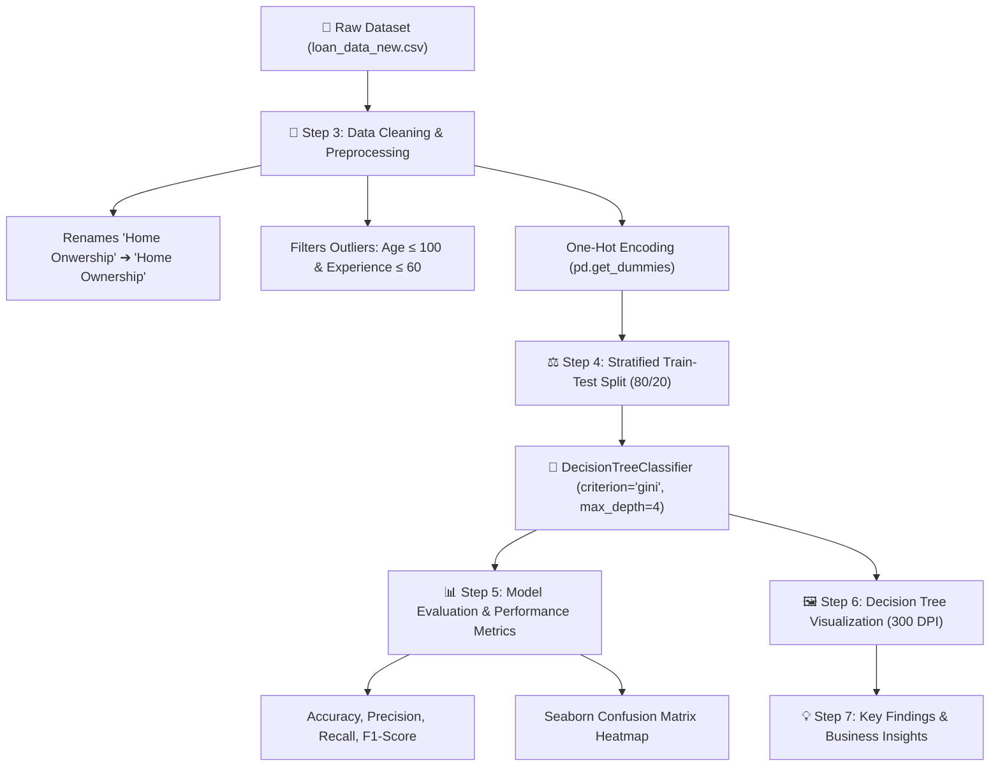

# 🏦 Automated Loan Credit Risk Approval System (Decision Tree Machine Learning)

[](https://www.python.org/)
[](https://scikit-learn.org/)
[](https://code.visualstudio.com/)
[](https://www.kaggle.com/datasets/muhammadmusharraf444/loan-approval-dataset)
[](LICENSE)

A production-grade Machine Learning experiment and interactive Jupyter Notebook (`loan_approval_decision_tree.ipynb`) implementing a **Decision Tree Classifier** (`DecisionTreeClassifier`) to automate **Loan Credit Risk & Approval** predictions (`0 = Rejected`, `1 = Approved`).

---

## 🎯 Problems This System Solves

Manual loan approval and credit risk assessment processes in banking and financial institutions suffer from several critical bottlenecks:

1. **High Credit Default Risk**: Inconsistent manual underwriting can lead to approving high-risk loans, increasing Non-Performing Assets (NPAs) and financial losses.
2. **Subjectivity & Human Bias**: Manual decisions often lack uniform standards, introducing bias and inconsistency across branch operations.
3. **Slow Processing Times**: Manual verification of loan percentage, income ratio, and credit history takes days or weeks, causing customer drop-offs.
4. **Lack of Explainability in Black-Box AI**: Complex deep learning or black-box ML models are difficult to explain to regulatory auditors and applicants who require clear reasons for rejection.
5. **Data Quality Anomalies**: Real-world loan datasets often contain typos (`Home Onwership`), data entry errors (`Age > 100`, `Employee Experience > 60`), and class imbalances (~77.8% rejected vs ~22.2% approved).

### 💡 Business Value & Key Solutions Provided
- **Automated Credit Risk Scoring**: Instantly evaluates applicant risk profiles using transparent financial criteria.
- **Explainable Decision Rules**: Decision trees generate auditable logic gates (e.g., Loan-to-Income percentage, income threshold, credit score boundaries) compliant with financial regulations (e.g., Fair Credit Reporting Act).
- **Automated Data Quality Pipeline**: Robust pre-processing filters data entry errors and corrects schema typos automatically.
- **Stratified Risk Sampling**: Mitigates class imbalance through stratified train-test splitting to ensure balanced risk evaluation.

---

## 🔬 How It Works (Technical Architecture & Workflow)

The system works through an end-to-end Machine Learning pipeline structured across 7 logical steps inside the Jupyter Notebook:



### Detailed Pipeline Breakdown:

1. **Data Ingestion & EDA (`Step 1 & Step 2`)**:
   - Loads applicant records from `loan_data_new.csv`.
   - Inspects missing values, summary statistics (`describe()`), and initial class balance.

2. **Data Cleaning & Anomaly Resolution (`Step 3`)**:
   - **Typo Correction**: Fixes dataset schema typo (`Home Onwership` $\rightarrow$ `Home Ownership`).
   - **Outlier Filtering**: Removes impossible data entry entries (`Age > 100` and `Employee Experience > 60`).
   - **Categorical Feature Encoding**: Converts string categories (`Gender`, `Education`, `Home Ownership`, `Loan Intent`, `Previous Loan`) into numerical dummy variables (`pd.get_dummies(drop_first=True, dtype=int)`).

3. **Stratified Sampling & Model Training (`Step 4`)**:
   - Partitions dataset into 80% Training ($X_{train}, y_{train}$) and 20% Testing ($X_{test}, y_{test}$).
   - Employs `stratify=y` to preserve the ~77.8% (Rejected) / ~22.2% (Approved) target class ratio across both splits.
   - Fits a `DecisionTreeClassifier(criterion='gini', max_depth=4, random_state=42)`. Hyperparameter `max_depth=4` prevents overfitting while ensuring high human interpretability.

4. **Model Evaluation & Visual Verification (`Step 5 & Step 6`)**:
   - Computes standard classification metrics: **Accuracy**, **Precision**, **Recall**, **F1-Score**, and **Classification Report**.
   - Generates an inline Seaborn Heatmap for the Confusion Matrix.
   - Plots a high-resolution 300 DPI decision tree diagram (`plot_tree()`) showing Gini impurity, sample counts, and feature split boundaries.

5. **Decision Rule Extraction (`Step 7`)**:
   - Extracts business rules: **`Loan percentage`** (Loan-to-Income ratio) is the top root split criterion, followed by **`Person Income`**, **`Credit Score`**, and **`Home Ownership`**.

---

## 📊 Dataset Reference & Link

- **Dataset Name**: Loan Approval Dataset
- **Kaggle Link**: [https://www.kaggle.com/datasets/muhammadmusharraf444/loan-approval-dataset](https://www.kaggle.com/datasets/muhammadmusharraf444/loan-approval-dataset)
- **Local Workspace File**: `loan_data_new.csv`
- **Total Initial Records**: 45,002 rows $\times$ 14 features

### Feature Schema & Anomalies Handled

| Feature Name | Type | Description | Anomaly & Action Taken |
| :--- | :--- | :--- | :--- |
| `Age` | Numerical | Applicant's age in years | Outliers $> 100$ removed (up to 144) |
| `Gender` | Categorical | Female / Male | One-Hot Encoded (`drop_first=True`) |
| `Education` | Categorical | Education level | One-Hot Encoded (`drop_first=True`) |
| `Person Income` | Numerical | Annual income | Validated positive values |
| `Employee Experience` | Numerical | Work experience in years | Outliers $> 60$ removed (up to 125) |
| `Home Onwership` | Categorical | RENT / OWN / MORTGAGE / OTHER | **Typo Fixed**: Renamed to `Home Ownership` & One-Hot Encoded |
| `Loan Amount` | Numerical | Requested loan principal | Numeric numerical scale |
| `Loan Intent` | Categorical | Purpose of loan (PERSONAL, MEDICAL, etc.) | One-Hot Encoded (`drop_first=True`) |
| `Loan interest Rate` | Numerical | Interest rate percentage | Numeric continuous value |
| `Loan percentage` | Numerical | Loan amount to Income ratio | **Primary Decision Driver** |
| `Credit History` | Numerical | Years of credit history | Continuous integer |
| `Credit Score` | Numerical | Credit score rating | Continuous integer |
| `Previous Loan` | Categorical | Prior loan history (Yes / No) | One-Hot Encoded (`drop_first=True`) |
| `Loan Status` | Target (Binary) | Approval Outcome (`0 = Rejected`, `1 = Approved`) | **Target Variable**: Stratified 80/20 split |

---

## 🛠️ Environment Setup & VS Code Integration

### Prerequisites
- Python 3.10+
- Visual Studio Code with the official **Python** (`ms-python.python`) and **Jupyter** (`ms-toolsai.jupyter`) extensions.

### Installation Steps

1. Clone or download this repository:
   ```bash
   git clone https://github.com/BangkimPathak/Loan-Credit-Risk-Approval.git
   cd Loan-Credit-Risk-Approval
   ```

2. Install python dependencies:
   ```bash
   pip install -r requirements.txt
   ```
   *(Note: The notebook also includes a top cell `%pip install pandas numpy scikit-learn matplotlib seaborn` for seamless inline execution inside VS Code).*

---

## 📁 Repository Structure

```text
.
├── loan_approval_decision_tree.ipynb  # Primary VS Code Jupyter Notebook
├── loan_data_new.csv                  # Dataset (Kaggle source)
├── requirements.txt                   # Dependency specifications
└── README.md                          # Comprehensive project documentation
```

---

## 🚀 How to Run in VS Code

1. Open the project folder in VS Code:
   ```bash
   code .
   ```
2. Open `loan_approval_decision_tree.ipynb`.
3. Select your Python 3.10+ kernel in the top-right corner of the editor.
4. Click **"Run All"** or execute cells sequentially using `Shift + Enter`.

---

## 📈 Key Findings & Risk Decision Rules

1. **Loan-to-Income Ratio (`Loan percentage`)**:
   - Acts as the root node of the decision tree. Applicants whose requested loan exceeds a critical percentage of their annual income face automated rejection due to default risk.
2. **Income & Credit Score Boundaries**:
   - Serve as secondary decision nodes. High-income applicants with strong credit scores pass through approval sub-branches.
3. **Property Ownership Stability**:
   - `Home Ownership_RENT` vs `MORTGAGE`/`OWN` serves as a key tertiary indicator reflecting asset stability.

---

## 📜 License

This project is licensed under the MIT License.
